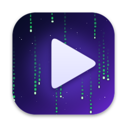

# VideoWallpaper

A native macOS app that plays high-resolution, seamlessly looping **video wallpapers** behind your desktop icons — with a built-in browser for downloading wallpapers, local generators for Matrix code rain and starfields, your own videos, and **different wallpapers per Focus mode**.

<p align="center"></p>

## Features

| | |
|---|---|
| **Live video wallpaper** | Muted, gapless looping (HEVC/H.264/ProRes, up to 8K) on every display and every Space, below desktop icons and widgets. Crossfades between wallpapers. |
| **Discover & download** | Category tiles — Matrix Code, Deep Space, Rain on a Window, SpaceX & Launches, Earth from Orbit, Nebulae, Northern Lights, Ocean, City at Night, Neon, Forest, Fireplace, Snow, Storms, Underwater, Abstract — plus free-text search across **Pexels**, **Pixabay** and the **NASA Image & Video Library**. Preview before downloading, pick a quality, one-click *Download & Set*. |
| **Create (no download)** | Renders **Matrix code rain** (6 colors, speed, glyph size, depth layer, mirrored glyphs) and **Starfield** (drift → warp, nebula clouds) at your display's native resolution as perfectly looping HEVC videos. |
| **Your own videos** | Drag & drop or *Add Your Own Video…* (MP4, MOV, M4V). |
| **Focus modes** | Assign a wallpaper (or per-display wallpapers) to each Focus — Work, Sleep, Personal, Do Not Disturb, or custom. Optional "pause video during this Focus". |
| **Multi-display** | Same wallpaper everywhere or a different one per display. |
| **Battery friendly** | Pauses when the screen is locked, displays sleep, the screen saver runs, windows cover the desktop, and (optionally) on battery or in Low Power Mode. |
| **Automation** | Shortcuts actions, a Focus Filter, and a `videowallpaper://` URL scheme. Auto-change every 15 min – daily. Launch at login. Menu bar controls. |

## Install

### Option A — download the build (no Xcode needed)

1. Open the repository's **Actions** tab → latest **Build** run → download the **VideoWallpaper-dmg** artifact (or grab the DMG from **Releases** if a `v*` tag has been published).
2. Open the DMG and drag **VideoWallpaper** to **Applications**.
3. The app is ad-hoc signed, not notarized, so the first launch is blocked by Gatekeeper. Either:
   - open it once, then go to **System Settings › Privacy & Security** and click **Open Anyway**, or
   - run `xattr -dr com.apple.quarantine /Applications/VideoWallpaper.app` in Terminal.

### Option B — build from source

Requirements: macOS 14 Sonoma or later, Xcode 16 or later.

```bash
git clone https://github.com/natentate/VideoWallpaper.git
cd VideoWallpaper
./scripts/build.sh --install     # builds, packages build/VideoWallpaper.dmg, copies to /Applications and launches
```

Or open `VideoWallpaper.xcodeproj` in Xcode and press **Run**. Builds made locally aren't quarantined, so Gatekeeper won't complain.

## First run

The app lives in the **menu bar** (▶︎ icon) and opens its library window on launch. Closing the window hides the Dock icon; the wallpaper keeps playing.

1. **Create** › *Matrix Code Rain* › **Render & Set as Wallpaper** — you'll have a wallpaper in under a minute, no account needed.
2. **Discover** › pick a category. NASA works immediately. For Pexels and Pixabay (best for rain-on-window, nature, city, etc.) paste a **free API key** — the card in Discover links to the sign-up page:
   - Pexels: <https://www.pexels.com/api/new/>
   - Pixabay: <https://pixabay.com/api/docs/>
3. **Library** › drop in your own videos.

## Wallpapers per Focus mode

In **Focus Modes**, choose a wallpaper for each Focus (Do Not Disturb, Work, Personal and Sleep are pre-created; add more with **Add Focus**). Use **Try It** to preview.

macOS doesn't let apps read which Focus is on, so you connect each Focus once. Three options:

| Method | Works on | Setup |
|---|---|---|
| **Shortcuts automation** (recommended) | macOS 26 Tahoe+ | Shortcuts › Automation › **+** › **Focus** › pick *Work* › *When Turning On* › *Run Immediately* → action **Turn On Focus Wallpaper** › *Work*. Add a second automation *When Turning Off* → **Turn Off Focus Wallpaper**. |
| **Focus Filter** | macOS 13+ | System Settings › Focus › *Work* › **Focus Filters** › **Add Filter…** › **VideoWallpaper** › choose the *Work* profile (or a wallpaper). It reverts automatically when the Focus ends. Note: Apple's Focus Filters have been unreliable on some releases (e.g. 26.5); use Shortcuts if it doesn't fire. |
| **URL scheme** | any | `open "videowallpaper://focus/on?name=Work"` / `open "videowallpaper://focus/off?name=Work"` from Shortcuts' *Open URL*, Raycast, Keyboard Maestro, etc. Copy them from the ••• menu on each Focus row. |

When several Focus wallpapers are active, the most recently activated wins. Choosing a wallpaper manually overrides any active Focus wallpaper.

## URL scheme

| URL | Action |
|---|---|
| `videowallpaper://focus/on?name=Work` | Turn on the *Work* Focus wallpaper |
| `videowallpaper://focus/off?name=Work` | Turn it off (omit `name` to turn off all) |
| `videowallpaper://set?name=Rain` | Set a wallpaper by name (optional `&display=Studio Display`) |
| `videowallpaper://next` | Next wallpaper |
| `videowallpaper://pause` · `resume` · `toggle` | Playback |
| `videowallpaper://discover?q=aurora` | Open Discover with a search |

## Shortcuts actions

*Set Video Wallpaper*, *Next Video Wallpaper*, *Pause Video Wallpaper*, *Resume Video Wallpaper*, *Turn On Focus Wallpaper*, *Turn Off Focus Wallpaper*.

## How it works

```
VideoWallpaper/
├── App/          App entry, delegate, main window, AppModel (central coordinator)
├── Engine/       Desktop-level windows per display, AVPlayerLooper playback with crossfades,
│                 system monitors (lock/sleep/battery/occlusion), optional desktop-picture sync
├── Library/      Library store (JSON + files), import, metadata & thumbnails
├── Online/       Pexels / Pixabay / NASA clients, downloads, Discover categories (catalog)
├── Generators/   Matrix rain + starfield renderers → AVAssetWriter (HEVC, seamless loops)
├── Focus/        App Intents: Focus Filter, Shortcuts actions, entities
└── UI/           SwiftUI screens and menu bar menu
```

- **Rendering:** each display gets a borderless, click-through `NSWindow` at the desktop window level (above the system wallpaper, below icons), joined to all Spaces. Video plays through `AVQueuePlayer` + `AVPlayerLooper` (hardware decoded, muted, never blocks display sleep).
- **Storage:** `~/Library/Application Support/VideoWallpaper/` (`Videos/`, `Thumbnails/`, `library.json`, `state.json`). API keys are stored in the app's preferences.
- **Catalog:** Discover categories come from [`Catalog/catalog.json`](Catalog/catalog.json) on the `main` branch when reachable, so new categories can be added without a rebuild (built-in list as fallback).
- **CI:** `.github/workflows/build.yml` builds a universal (Apple silicon + Intel) DMG on every push; pushing a `v*` tag publishes a GitHub Release.

## Licensing of downloaded content

Videos downloaded through the app come from Pexels, Pixabay and NASA under their own licenses (free for personal use; see each site). Attribution links are shown in Discover and kept with each wallpaper (*Open Source Page*). Generated wallpapers are yours.
